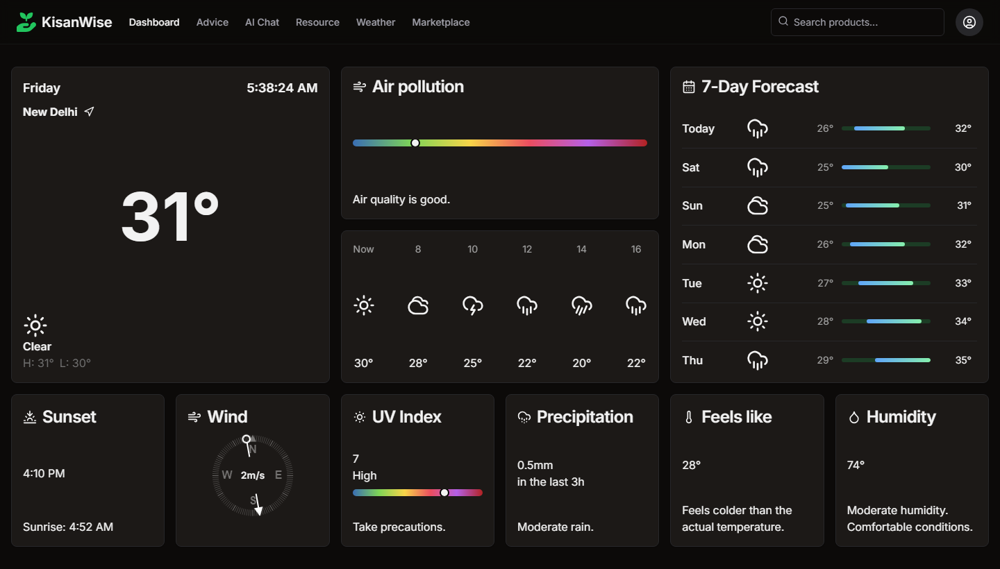

# 🌾 KisanWise - Frontend Showcase for Agricultural Advice Platform


[](./LICENSE)

**KisanWise** is a frontend development showcase project demonstrating a mock AI-powered agricultural advice platform. This project highlights advanced frontend technologies and design patterns.



## ✨ Features

- 🌦 **Weather Updates UI:** Interface for displaying real-time weather forecasts.
- 🤖 **AI Chatbot UI:** Mockup for an AI chatbot interaction.
- 📚 **Resource Library UI:** Design for an extensive library of agricultural resources.
- 🌱 **Personalized Advice UI:** Mock interface for receiving tailored advice based on user input.
- 🛒 **Marketplace UI:** E-commerce design for agricultural products.

## 📋 Table of Contents

- [Installation](#installation)
- [Usage](#usage)
- [Features](#features)
- [Contributing](#contributing)
- [License](#license)
- [Contact](#contact)

## 🚀 Installation

Follow these steps to get started with KisanWise:

1. **Clone the repository:**

   ```sh
   git clone https://github.com/DavyJonesCodes/kisanWise.git
   cd kisanWise
   ```

2. **Install dependencies:**

   ```sh
   npm install
   ```

3. **Run the development server:**

   ```sh
   npm run dev
   ```

## 💻 Usage

To explore KisanWise, navigate to `http://localhost:3000` in your web browser. This project is a frontend-only mockup intended to demonstrate UI/UX design and frontend development skills.

## 🌟 Contributing

We welcome contributions! To contribute:

1. Fork the repository.
2. Create a new branch: `git checkout -b my-feature`
3. Make your changes and commit them: `git commit -m 'Add some feature'`
4. Push to the branch: `git push origin my-feature`
5. Submit a pull request.

Ensure your pull request adheres to our coding standards.

## 📄 License

This project is licensed under the MIT License - see the [LICENSE](./LICENSE) file for details.

## 📞 Contact

For inquiries or support, please contact:

- **Dev Jones**
  - 📧 [devjonescodes@gmail.com](mailto:devjonescodes@gmail.com)

---

Thank you for checking out KisanWise! 🌾 This project demonstrates my frontend development capabilities.
